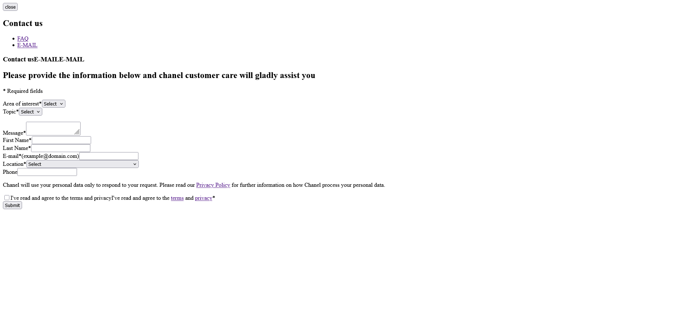

# Correction d’une erreur sur le site Channel.com

## 🔍 Contexte

En explorant le site [Chanel.com](https://www.chanel.com), j’ai remarqué un dysfonctionnement affectant l’affichage du [formulaire de contact](https://services.chanel.com/en_WW/contact).

Ce dépôt présente ma reproduction du bug et la proposition de correction que j’ai mise en œuvre à des fins pédagogiques.

---

## ❌ Bug observé

- L’erreur se produit sur [décrivez l’environnement : mobile / desktop / tous les écrans].
- Symptômes : [exemples concrets — ex. : un bouton non cliquable, un élément qui déborde, une animation cassée…].
- Technologies concernées : [par exemple : HTML/CSS, JavaScript, jQuery].

## 🖼️ Capture du bug

Voici une illustration du bug observé sur le site Channel.com :

---

## 🛠️ Démarche

1. J’ai inspecté le code source à l’aide des outils de développement du navigateur.
2. J’ai identifié que l’erreur provenait du fichier CSS.
3. J’ai recréé un environnement local pour reproduire l’erreur de manière isolée.
4. J’ai proposé une correction fonctionnelle et responsive.

---

## ✅ Résultat

- Le bug est corrigé : L'application du style est maintenant pris en charge.
- Compatible avec les navigateurs récents.
- Testé en responsive design.

---

## 🔗 Accès rapide

- 🖥️ [Voir la démo (si hébergée)](https://...)
- 📁 [Voir le code source](./index.html)

---

## 💬 Remarque

Cette correction a été réalisée de manière indépendante, à but non commercial, dans le cadre d’une candidature et d’un exercice technique. Je reste bien sûr disponible pour échanger sur cette démarche ou approfondir l’analyse si besoin.

---

## 👨‍💻 Auteur

[Ryn-Bghl](github.com/Ryn-Bghl)
Étudiant en BUT Métiers du Multimédia et de l’Internet  
[Portfolio](https://rayan-boughalia.netlify.app/)
